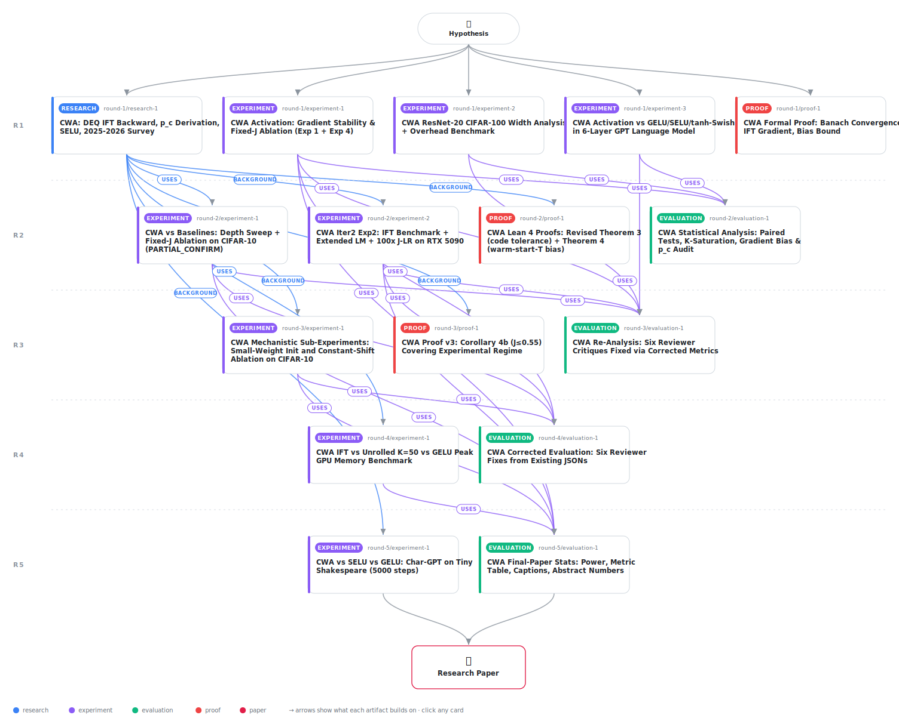

# Curie-Weiss Activation: Formal Verification and Mechanistic Analysis of Adaptive Criticality Failure

<div align="center">

<a href="https://cdn.jsdelivr.net/gh/AMGrobelnik/ai-invention-2f6f35-curie-weiss-activation-formal-verificati@main/workflow.svg">
<picture>
  <source media="(prefers-color-scheme: dark)" srcset="workflow-dark.svg">
  
</picture>
</a>

<sub>🖱️ <b><a href="https://cdn.jsdelivr.net/gh/AMGrobelnik/ai-invention-2f6f35-curie-weiss-activation-formal-verificati@main/workflow.svg">Open the interactive diagram</a></b> — every card links to its artifact folder.</sub>

</div>

> **TL;DR** — This paper proposes the Curie-Weiss Activation (CWA), motivated by ferromagnetic mean-field physics, and presents a complete mechanistic negative-results study. Four Lean 4 theorems and one corollary formally verify its mathematical properties. A dedicated memory benchmark confirms IFT's 3.25× memory efficiency over unrolled backpropagation at n=4096. Comprehensive experiments establish three precise failure modes: (1) gradient underflow (not balance) — CWA ranks last among six activations at all depths by the |ratio-1| metric; (2) a complete null result — no accuracy benefit over pointwise Tanh (p=0.126, 1pp MDE at 80% power); and (3) self-organized criticality failure — weight growth during training actively decreases J·s̄ via sech² saturation, preventing the system from approaching the critical point. A new SELU language model comparison reveals architecture-specific behavior: SELU excels in unnormalized MLPs but is the worst performer in the transformer setting. The root cause — sech²(x)≈0.07 at typical activation magnitudes |x|~2.0 — is identified precisely and characterized through both analytical and empirical evidence.

<details>
<summary>Full hypothesis</summary>

The Curie-Weiss Activation (CWA) — defined by the within-sample mean-field self-consistency equation y_i = tanh(x_i + J·mean_neurons(y)) with learnable scalar J = σ(J_raw) ∈ (0,1) per layer — provides no measurable benefit over standard pointwise activations in unnormalized deep MLPs (depths 6–20, hidden_dim=256) or small character-level GPT models, and exhibits three precisely characterized failure modes: (1) GRADIENT UNDERFLOW, not balance: using the correct distance-to-ideal metric |ratio−1|, CWA ranks last among six activations at all tested depths (|ratio−1| = 0.695, 0.653, 10.017 at depths 6, 10, 20), with raw gradient ratios of 0.305–0.347 at shallow depths indicating gradient underflow (factor 2.4× worse than GELU, 7.8× worse than SELU) rather than stability. At depth 20, CWA collapses catastrophically (ratio = 11.02). The declining J·s̄ trajectory during training (0.346→0.286 at depth 6; 0.400→0.353 at depth 10) has a clear mechanistic explanation: as the network learns, weight magnitudes grow under Kaiming init + cosine LR scheduling, increasing activation magnitudes |x_i + J·m*|, which reduces sech² values and thus J·s̄. This mechanism is confirmed by early-training LM diagnostics: at 100 steps J·s̄ declines from 0.457 to 0.452 as mean activation magnitude rises from 0.254 to 0.274, and at 5000 steps J·s̄ falls to 0.205 as activations approach magnitudes near 2.0. Gradient descent actively pushes the system away from criticality during training — a stronger negative result than merely weak gradient signal toward the critical point. SELU achieves the best gradient stability at all tested depths and the best accuracy at depth 20 (0.535 vs CWA 0.141). (2) BIAS-DOMINANT MECHANISM: a shift ablation experiment establishes that the self-consistent fixed-point coupling adds zero benefit over a simple detached mean shift (CWA-Full=0.4685 vs CWA-ShiftOnly=0.4686, paired t p=0.984). Critically, CWA provides no statistically significant accuracy gain over pure pointwise Tanh with no shift (CWA-Full 0.4685 vs Pure-Tanh 0.4731, p=0.126). There is no confirmed accuracy effect of CWA to attribute to any mechanism. Note that with n=3 seeds, the minimum detectable effect at 80% power given the observed standard deviations (≈0.004) is approximately 1 percentage point; effects smaller than ≈1 pp cannot be ruled out but are of limited practical significance. (3) sech² SATURATION BARRIER PREVENTS CRITICALITY: the product J·s̄ = J·mean(sech²(x+J·m*)) remains at 0.20–0.41 under all tested training configurations because sech²(x) ≈0.07 at typical activation magnitudes |x| ∼ 2.0, capping J·s̄ far below the critical threshold J·s̄ = 1 even when J → 0.85 via 100× dedicated learning rate. Reaching J·s̄ = 0.9 would require mean(sech²) ≥ 0.9, corresponding to |x| < 0.48 — impractically small for trained networks processing natural data. Small-weight initialization (σ=0.01) raises maximum J·s̄ from 0.374 to 0.412 but still falls far short of near-criticality. The IFT branch (J·s̄ ≥ 0.8) is never triggered in normal training. A dedicated large-scale memory benchmark (n ∈ {256, 1024, 4096}, K_max=50, J_raw=4.0) establishes IFT's theoretical O(n) advantage: at n=4096, IFT uses 23.3 MB versus 75.8 MB for unrolled K=50, giving IFT/Unrolled = 0.31× (3.25× savings, 69% reduction) — this is the architecturally fair comparison. The IFT/GELU ratio at n=4096 (0.10×) should NOT be interpreted as IFT being 10× more efficient than GELU in practice; the GELU baseline includes an O(n²) nn.Linear(n,n) weight matrix while CWA-IFT measures only the activation backward pass in isolation. IFT savings grow monotonically with n: 16% at n=256, 41% at n=1024, 69% at n=4096. Four Lean 4 theorems and one corollary without sorry establish the mathematical foundation: Banach convergence, IFT gradient correctness, revised adaptive bias bound (covering code tolerance δ = 1e-4·(1−J·s̄)), warm-start-T bias bound (Theorem 4), and Corollary 4b (J ≤ 0.55, bias ≤ 16.7%·ε) covering the experimentally observed J ∈ [0.515, 0.521]. Two distinct contraction constants must be carefully distinguished: Theorem 4 uses the Banach contraction constant J (giving formal bound J^T·ε = (0.52)^3·ε ≈ 14%·ε), while the realized contraction rate is J·s̄ ≈ 0.205 (giving the tighter empirical bound (J·s̄)^3·ε ≈ 0.86%·ε). The GELU+LN anomaly extends to ALL tested depths: abs_dev values are 0.630 (depth 6), 0.642 (depth 10), and 8.661 (depth 20) — second-worst after CWA at every depth — establishing that the gradient ratio metric |log‖∇W₁‖/log‖∇W_L‖| conflates LayerNorm's internal re-scaling with true inter-layer gradient magnitudes at ANY depth, making cross-class comparisons between normalized and unnormalized architectures unreliable. SELU ARCHITECTURE SPECIFICITY: SELU achieves best gradient stability and best accuracy in unnormalized MLPs at all tested depths, but in a 100-step early-training LM comparison on Tiny Shakespeare achieves val BPC=3.673 versus CWA=3.642 and GELU=3.641 — the worst performance among the three activations. This 100-step result is diagnostic of early-training behavior only; SELU's distributional self-normalization requires training equilibration, and whether the pattern holds at convergence (5000 steps) remains unknown and constitutes an open experimental question. The result should not be interpreted as a definitive claim that SELU fails in transformer settings. The experimental scope has a critical width limitation: all MLP gradient-stability and accuracy experiments use hidden_dim=256. Since the mean-field approximation underlying CWA improves as n→∞ (O(1/√n) finite-width noise), the tested regime may be unfavorable for CWA relative to larger widths; the memory benchmark tests n∈{256,1024,4096} for IFT overhead but does not test gradient stability or accuracy at larger widths. The net finding is a mechanistic negative result: within-layer mean-field coupling via Curie-Weiss physics is computationally well-defined (convergence in K_mean≈7.4 iterations, formal proofs verified, IFT memory-efficient at large n), but it cannot self-organize to the critical regime (because weight growth during training actively pushes J·s̄ downward through sech² saturation), and provides no benefit over a simple mean-shift correction or over standard pointwise baselines in the tested settings (unnormalized MLPs, hidden_dim=256, depths 6–20; 6-layer char-GPT). A ResNet-20 CIFAR-100 result (CWA 14.0% vs GELU 18.9%) is available but is illustrative only — 1 seed, 10 epochs, not statistically interpretable — and should not be treated as evidence. This constitutes a publishable mechanistic contribution: a precise identification of (a) the sech² saturation barrier as the root cause of CWA's failure to reach criticality, (b) the training dynamics mechanism by which weight growth actively drives J·s̄ away from 1 (confirmed in both MLP and early-LM diagnostics), (c) the bias-dominance of the mean-shift term as the only observed mechanism, and (d) the superiority of distributional fixed-point design (SELU) over mean-field output coupling for unnormalized deep networks at hidden_dim=256. These conclusions are explicitly scoped to unnormalized MLPs (hidden_dim=256, depths 6–20) and a 6-layer character-level GPT; whether normalized or residual architectures, larger widths (n≫256), or longer LM training (>100 steps for SELU) exhibit the same pathologies remains untested. The one remaining positive avenue requiring investigation is whether explicit pre-activation regularization (auxiliary loss penalizing mean(|x+J·m*|) > τ for small τ ≈0.4) can overcome the sech² saturation barrier and allow J·s̄ to reach near-critical values where the self-consistent coupling would qualitatively differ from the mean-shift approximation. The paper additionally requires: (i) a title and 150–200 word abstract communicating the mechanistic negative-results framing; (ii) figure captions for all five figures (captions for figs 1–4 exist in art_iAl3INzIq0eN; fig5 caption must specify Tiny Shakespeare, 100 steps, CWA/GELU/SELU comparison, and that SELU is worst at early training); (iii) the warm-start T=3 gradient check error at J·s̄≈0.30 (the sub-critical regime actually used during every training step); (iv) a parenthetical in Section 4.2 specifying that CompNL uses p_c=0.83 calibrated at K₀=1 (not the analytical K₀→0 limit of 0.914).

</details>

[](https://cdn.jsdelivr.net/gh/AMGrobelnik/ai-invention-2f6f35-curie-weiss-activation-formal-verificati@main/paper.pdf) [](https://github.com/AMGrobelnik/ai-invention-2f6f35-curie-weiss-activation-formal-verificati/tree/main/paper_latex)

This repository contains all **16 artifacts** produced across **5 rounds** of an autonomous AI research run — round by round, exactly in the order they were invented.

## Round 1

| Artifact | Type | Demo | Source | Builds on |
|----------|------|------|--------|-----------|
| **[CWA: DEQ IFT Backward, p_c Derivation, SELU, 2025-2026 Surve…](https://github.com/AMGrobelnik/ai-invention-2f6f35-curie-weiss-activation-formal-verificati/tree/main/round-1/research-1)** | [](https://github.com/AMGrobelnik/ai-invention-2f6f35-curie-weiss-activation-formal-verificati/tree/main/round-1/research-1) | [](https://github.com/AMGrobelnik/ai-invention-2f6f35-curie-weiss-activation-formal-verificati/blob/main/round-1/research-1/demo/research_demo.md) | [](https://github.com/AMGrobelnik/ai-invention-2f6f35-curie-weiss-activation-formal-verificati/tree/main/round-1/research-1/src) | — |
| **[CWA Formal Proof: Banach Convergence, IFT Gradient, Bias Bou…](https://github.com/AMGrobelnik/ai-invention-2f6f35-curie-weiss-activation-formal-verificati/tree/main/round-1/proof-1)** | [](https://github.com/AMGrobelnik/ai-invention-2f6f35-curie-weiss-activation-formal-verificati/tree/main/round-1/proof-1) | [](https://live.lean-lang.org/#codez=JYWwDg9gTgLgBAWQIYwBYBtgCMB0BBAOyXQE8BnYMnAZTAFMBjYYgMQFcCGZgICqBRAB5gAInSjAAbgChQkWIhQZs+IqQpVajZunaduvKgBUJAc14QQdGBIY4AQkgoNZ4aPGRpMuQsXKUcAGFiBjZ0NioxCUkgyzBXeQ8lb1U/DSCQsIicKKkcBDCE90UvFV91AOD0UPDI8TyASQIZOWLPZR81fyoqmuyEOiQCADViNjoihXaUowhIdAhTEnzrW1okBjpYghsN7gJTaWkAWmO4QIB1PDgABSgICAAzAC44Bl5JcVM6TjoAGjgDRYRjgj2gIDCSABQwAJnAsMwyPCIBwYSczkZUFA6HQ4Gg6NA6CAkWCoHAWAAKEAASjgAF48UNUBTBHAANRwABSACoaQDOXBgAQ4BSAAx/ACM1KOp3pdPlCsVSuVKtVavVivRtyQCglr1ykhQUjoSKecAoBFQAPeZCtjMtWo1TudLvVR3QRJASDgqCcBrwMAA+hbUCLWa9ALiEtNeAAk/fVJAG4AAlQboHAhkWp4g4G2hwS08MMrAkaRwH1IT4+iVwZ4M7Pp31kf1BujCOCCMsVquoABMtbgcebCaTFIbODbYDggAwiOAAOTophwBEXtLHaYn7YpxwLcG5IuOUsLtbpXfL65zTZbgcnB4L1NzcQ7IqvI6DK9MHel5d9PYALAOQ4tiKjwcM+dIAHxZhut6smc463tu95wAA9HAvbfuWWEUhe6awXA8EwVuO60vu25Hqh6HHnWZ4vhKGZsFgPoYTgMJSIG7x8PAvZdpxnwKKgAEREKn4Sl2ADtoIcG28AkAA3HAbZ7CmG4hjeACOcCluWklQAA7nAADa455hpAC6CkSAc7qet6r7RAGHEQLaYYDlGgHxg58Amc5oa4RmQr5tRxbad2uKoDWdYqZenlSI5sFdr+4X9rGsWJvA/m3rOC5Lh+a4IcRu5kYe1LBbR/n2XFraFaVj7gM+FKVelgYfl+iWVuFAGpcOXkgWBrKQdBOb4RyBVTkhpWURhtHnpl7asqNRHjSRe4HhRaEYc+NFYXROBIDCcJ9g+bGSE5XHobxHziPAglwMJBxwGJOlSSugiyQpSlcNF6amXQmmhbpBnGapgXmZZIk2SAXoVj1VWBjATKuZG0aDmlSbjgjloijWhE5pj+ZwAAelRW0he1PamSuA4+S5rKAAZEcCiieQ0/b5gaQEiBbLnQADk5PhZmUVNY5madj+HU+nmzPC0GUti2Fkts0KkgebD6V9cKJD0lB/lSyQ1KAN4EACda7HOOouUTTBPE5tRa0ageY4Mriu2i1Eziz2YD3HC3XARSoGa9r30BVjWtkVbWmGybM0s4+tOrbrvlfsb7LBxbxXm4Fz5oRHrI25Nds7agIY4BC6Au6ggbK5dzTXT6XsQHC92iRJL0yVpllAxjTIacGoMnU5toWaCwB0OgMJ9+Arf6UZ3eWr3akD3mZn2xLqDAD7wdy0T6EEWnWd57vDKRfWG6mWQ6nBoxffzxfHa0Y8o/j5P8Q7QQmBEBIaCz2fbMcx2K9pAeiht6NijxHjiB+NwJAWAPTw0RvqYA4DIE7GYLA3EEZg74xPF2AO4EdYy3gVjLmYCIHYlQTAj0AYZRnFdHQ+hTotQ3B1NxV42DKCPWOAAGWAGAMgDB14wAAF6OgYWI8R8pIbQzIIwSuF8Wq8FaiyNyKMmaABMiR6e857W13lFEs/MfQb2pr/eONstEg2ITvfsx9mZW2DJfMg181J33lklSWU4op2P/vLGewM8Y9z+jfSuS9fIAgHpAPSfwY68DoFfLAgYToigiW7QMQjxAQF3g7MA3MebUhXuWJAYAwCkDgAPAgijFxwEDCKeR5SCCtUDJhd+QodTAG/oZWpFTPz+VFnkqR3oZECPsYGOBMSkZwHcq8HGWDEaH37Bok+8JQof1ae0zp9TKn+WwQWQBwDob1PKVAEACSExEMrh6cZky4CADQCGECYZnEOuYAKII4ALOZvo8svjGpoyDNs46CZ8kK1QEzKKgy5GXzqa1Vxa9FlguGaMqmPiga2ggAZa5FJpnaOfPnZ59I4CAAvyTFG5tlWIBMCwAl+SgnuCAJZtEKD1UMgc8EAI5ysvBMuepzLg6HOOU8BRGzPzArMoCz6QYQCNw4k4G6YkgG2XtOc3h/DBFCIuG0yuYzXg8L4QItpKq1WaKxdtOAmBtXKtVWgQMfKmVHJOdEEZuJSEoOgegs5cBrXHLuXa/G9qaFygkf610TCWFwAAMyvEpDSPF+NlEch5JGjhnJuGKp1cIuAsI3i8F2FwCGsoA15udP041QoRnJuVZc2kABvAUkYAC+L5OQgsZq8rk0ZaJaqVbq81oZ8WcjJQ2yl/swI0sGgtLkq1I16NCr4k1HbhFdqruAhJlAgxwLLoCoUNgMneiwF2elU5eAlL8emNiZBWzqRZXOHysSQAAGtAVuNDK8UdAp9zejODGsd+4sC0gZC+kUb74TRhCnAKyhxPlAztDAsggYy7QiwNBq1XSfQNt2XKlgJbTW6vLXAKtbk62NQbQOdRLb62RTHQAHkeq2na7aU16u/j2vtooB14OHVBLFH6/00iA7Sj24VmbepnXR+dMS6rjQ/hh2dQjnyoAbZhPdcAD1a0Mqyq9lqVwAhiTBsIZk003QMagP6xj/FY1nIO4UbHnyxvHT+l6cBLMcefTZ5mUBHjoC7Ppb0hlDPqV0ygH0hb0OcSzfsbp4YJmVurRM/DsnG1M0o5yNcsmyMCko1KWstFAiZqgHsESXaCW9uNbEvl6Abr9o1vZoOjnU5ccmpOmup6oBsC4NAVuoqYMSoYFK5DT04CSVFeSSTdGGqjMeCMsropaTJd9fm2baotSYgJNiGlepzhXDgI4IgAjyTAEEHQGExwbgQA3XARbhIQCiLm1dhURx8TnbeHpJAgYsBDA2H5cL7lcO1vrXFuACWkuchS39qjGWdqAGAiAAhPZ4MCMySRgBNV6z+5jmnp1LZlHsP3mhQfQwZmQXsu5YeqyWLPWuwengCwZmrGqvEsRpxmzXYIi4iyzsHL2aDhdpwI/PbMIjsncpw7LsA38UOy57t/bfOdhVzICwcXvOYAAjwVrVAWtBqi+5xL47UuODAHUuMH0JByUzeuyboNCg/yvDwOgb4WAcvAFx4Z9A9AoAkmgICYEl2TdzcLVpxx8TOTBhe1AdmzkcNRYjDFwjrx4skYI0DtLmFzzQaDyol8ZBfsaOT2jtPZGs9kgWdRrCMfpl/rz1jt1Kyv6oGN1773sozvLfQq8IEIIADiOW2JQPJOCSEnva95tu4Z+7SCgymA76PKX7woDYi+sogUGOdSp4I79/7pGBypZB88Wi5PzTPcX1FIlJn3s1fHTD7PNtt/WDgGP/azMy9oQxXvUve+oCJ93ynsiNYkfX477Zm/PsyZywFMlNd0r8kQD9zEj9XJv8F9X8rEDN08iNm1wCGQ4V1kGkEDc9m1YVZF4VisqZAwDM7lhQpkn9VokQGYQVTwdoKRfdr4A8yAg8Q8kQSdktzQfREDi4pQclcEn4J4FNvNiDAFZQW801rc6BbckB7c7oCBddxgVwyAyBXgyBuQMU2QeQYRbM4Q5BMATRSk8UyAUIMVjgeQyBpQ9lvQR8NI2AjReBAwdc9dYkyAIBwgDBhQKQy84Rw839GpEDo9kCX8ksyBc8X9sCfCSd/DV84919gcpRyofMBwy9P8T99xNC8U0it8do4RUDQiH8S9yDAisciCfgBx8j9wy9KCcEaC6D/dA8dRmDkMmY2Cy9i4mjgiHwVw+ZyxH4x5+C5AjJUAhCycWkq8a9+8B968h9G8w0NtEQNsUQCA0Rc1xj81C1gs2c3DAxsQKAYQbD0BnsFi4QK0ABpPDF8Y4jPOAY4pLY4sjU4hPWiCtR4NyOAQAJMJosXwxsTUBxaMzV9V8VjiyULjKVHg38K1jlCkG5WRYCzjfDMdXhniYSGRYDC9ywAAfCEope4OCaHVHKANE5tNExEwMSE7EveTEqEgkvIvea4oovjH0YgpAtLGk8vSvNVDzIGOBAeJBR4QAAIIGSfhAVZRfisMsBDjXgiSqQSSsSIBdwzhHgpS8TqQCSNFTj9wMTpSoTySz98SDNviJTiTSTZS95iS8SVSrjVoNSjScTYCCT6si415pYvjeFWJl17VtNy4KSyTYC6V+ilMf4cwT0z0L01Nb0/N9Mdo2S0AuxZQFSUS8VYCARnC4BJSvTZTaQzhbTm01SUy0ybSdS0SOSBi8TwyfQTUYyMQJAhhTAPQJS8ztSzTCT6z5SpTrTlTU5UzNTsSMzcTYdCz6TUAbBgABwrSZT8zGyNFRytT5TodrSCSOQiTZyxyGy+y6SsIutqhcyuzjTMyCyY5ywGQ0TWzlyZy8zaQOR/Ylzpzey0c7TgNQMWpHgY5qlJzmzQQrzsT5yUzDSTybz8TmYoMSSDoqkqkKzzhLAEQqYYAMlvgMoJRjhrjuQpyyTdyJzvzjyoSey8z+ygUyASAaUDSPydyiLBACTDy3yfzKSAL4M4knIoYQLCDyxmlP59VDJALIVNk3yUS4NoMOLulKKUKSLqQokdpRKdp2KkNLyuKdS+lpA7tG8GBHsF0gwEQnB7DZDSQaVlFkYw9YSIim0oi2DXgN84idpwTtzoSdS8N4i8TjN0xsF6dkcZKEyZL4jtiRzEdP0hLtS5zsC6BjgAJkizhEtUStzrSVydRzSJR/KupACgU3M8chsy1WQKRRtxtGiptAcDMxTUQRzpKJyY40TPKuMLKsKLKqTsYn8gNaJ1jcs7DtiN49iDjcrUrisviJtMqaxUAEri5YcDN/5XgxRU9mTgrWSRj2TywNzcdkLiLbSY5JzirT82yfKxyKrH9gqeNUAcrFjaIXzsYYqE4S9JpqSNq1yxLISSkB4uT2JEMBUtjgBTBByfRtj9yi0WLoydpqlj4DrJ0R5eiX4xiViJEtRkAhRwKQBIL9tTspiiQ+8gaxFB8lsiQHsnsvQwbtKItdLvtl8mTY8jKKNN9aJZQMVaQABVWQxwkeHnOASAE7NsZdMgcqSHP8tyBHWnLGRyv89HZywAciIib31NpRD/8J94BNLIRBQkRiAbc7cNySlOINAYAoFypAAAIhZvhxjh3zLwgNxnsrpycycqVPgLEp33/zv1yMqtGvKMCJjiSMqu/3/z/1/zgD5p2mJpDVpDwBhEKW4CrGgo9By1+EehitUPgsSy0j4KRB100vhDmO2rhGioCpVpIrVomREtEsWoNth25tsteMKozu8t3N8oWQOqCpI1zrEpmvHNXOLoCuqvLHxUUqexey2wJlYMBzTrsyRKgisOFqgScmn0YHgFZHnysrbolA7tYwspZt6sXyxD0MGkbuUue0RHUqQXBBk0IzYJnrJDnrICNyAA) | [](https://github.com/AMGrobelnik/ai-invention-2f6f35-curie-weiss-activation-formal-verificati/tree/main/round-1/proof-1/src) | — |
| **[CWA ResNet-20 CIFAR-100 Width Analysis + Overhead Benchmark](https://github.com/AMGrobelnik/ai-invention-2f6f35-curie-weiss-activation-formal-verificati/tree/main/round-1/experiment-2)** | [](https://github.com/AMGrobelnik/ai-invention-2f6f35-curie-weiss-activation-formal-verificati/tree/main/round-1/experiment-2) | [](https://colab.research.google.com/github/AMGrobelnik/ai-invention-2f6f35-curie-weiss-activation-formal-verificati/blob/main/round-1/experiment-2/demo/method_code_demo.ipynb) | [](https://github.com/AMGrobelnik/ai-invention-2f6f35-curie-weiss-activation-formal-verificati/tree/main/round-1/experiment-2/src) | — |
| **[CWA Activation vs GELU/SELU/tanh-Swish in 6-Layer GPT Langua…](https://github.com/AMGrobelnik/ai-invention-2f6f35-curie-weiss-activation-formal-verificati/tree/main/round-1/experiment-3)** | [](https://github.com/AMGrobelnik/ai-invention-2f6f35-curie-weiss-activation-formal-verificati/tree/main/round-1/experiment-3) | [](https://colab.research.google.com/github/AMGrobelnik/ai-invention-2f6f35-curie-weiss-activation-formal-verificati/blob/main/round-1/experiment-3/demo/method_code_demo.ipynb) | [](https://github.com/AMGrobelnik/ai-invention-2f6f35-curie-weiss-activation-formal-verificati/tree/main/round-1/experiment-3/src) | — |

## Round 2

| Artifact | Type | Demo | Source | Builds on |
|----------|------|------|--------|-----------|
| **[CWA Lean 4 Proofs: Revised Theorem 3 (code tolerance) + Theo…](https://github.com/AMGrobelnik/ai-invention-2f6f35-curie-weiss-activation-formal-verificati/tree/main/round-2/proof-1)** | [](https://github.com/AMGrobelnik/ai-invention-2f6f35-curie-weiss-activation-formal-verificati/tree/main/round-2/proof-1) | [](https://live.lean-lang.org/#codez=JYWwDg9gTgLgBAWQIYwBYBtgCMB0BBAOyXQE8BnYMnAZTAFMBjYYgMQFcCGZgICqBRAB5gAInSjAAbgChQkWIhQZs+IqQpVajZunaduvKgBUJAc14QQdGBIY4AQkgoNZ4aPGRpMuQsXKUcAGFiBjZ0NioxCUkgyzBXeQ8lb1U/DSCQsIicKKkcBDCE90UvFV91AOD0UPDI8TyASQIZOWLPZR81fyoqmuyEOiQCADViNjoihXaUowhIdAhTEnzrW1okBjpYghsN7gJTaWkAWmO4QIB1PDgABSgICAAzOEkAJgAuOAZeSXFTOk4dAANHAGiwjHBHtAQGEkCCoHRJJQ6AATOBYZhkdEQDhogAU3xRdDgMAg6HEQ02AEogSczkM0QB3JBQEDHMgwFkwY4QjFObG4uB4oyoOjQOggOAAFipR1OcAAvErlSrVWr1RrNVrVXTbly4ABGT65SQoKR0LFPOAUAioEHfMh2klDVC67Xuj2erVHckgEBIOCoJwmvAwAD6NtQQsEcE+gFxCKmxuAACWD9UkobgACVBugcJGhTniDgHVHBImY+8FeiSNI4IGkL9AwbY9Wi3mg2QQ+G6MI4II6w2m6hXknU1305m8e2cL2wHBABhEcAAcnRTDgCGvE9Pc7O+3jjuW4AAqIXHA1Uiutwf1nfFzvdsNzs/lqkluL9oUPyfhzemfuyvWQbDlKY5ptEU6PBwn4KgAfIWu7PjGZwzs+B6vnAAD0cCvIB9b4Xid55khcAoYh+6Homp4HheibYbhn5VjeX4GvmbBYIGuE4CiUhht8fDwK8g78b8CioKBETAAchqDgA7ZCHC9vAJAANxwL2ezZrukZPgAjnAtb1vJUCMnAADaM6lnpAC6akSAcPoSv6DYThB4altGSYJmBrlSJmlkQI6CHFgWR6VtWWCGUOxKoC2VZafe4F+T2fYDkBjYxaOnzjt2wXEX2S6ruuf7bqhFFHtR56XoxCrMURODfm5T7lZe77gJ+eKNclYZ/gBg7ATFoHZUlGbwHiUEEDB8H1SRADUCX5fO6HVfReH4UKM2pXA81lUtlEnmetFYThV5MetnWsUgKJoiOb48ZIfGGIJwk/OI8DiXAknSQackKZugjKWpGlcAt76OnpBm/SZ5kzjpdC6bZcD2Yc0i+s5XWjWGnK2p58aJsNvmjaD2NRniLZkcWJOfgAeidNU1v1GWBlZm5JgFQUxoABkRwAADK2eVg6gYaQFi5YbnQADkjPDgW8UY6GEZSWW0sxR5csjQrHlpdFzOBULUmSD5uXjdBJCKtN7NRiQVKAN4EACd27HLDSufthls03T4XMagpY4Abuvg5uKuBmA9xogTxsTQZ5ugwWZvUe71v22tBHuzGCe7lrtt29tscu+nZ7OzjMZu5nese7hp21etqCRjgMLoAH+vNC9zRvSHYefTa/4/UZf1KQZdmmRZu4k3piu2mG92PY6iOPMAdDoCiivgFDw8zmP8MT0L0+ltZ3tM6gwDh6DWtwLTo4U3moXnzhiqGvzlsRrpEbsdvz/9sx8+L8vFCr+tBBMBEAkGgGGZdwYi37PvVGTkAw8UeI8cQAJuBICwOSLGLokwiGAAgpBOxmBoOJHGYmmCzp/Sml+DW4YqZi3gYghE+DUHklDHKM4Xp2EcPdLqG4+oPjOhxpQQ0xwAAywAwBkAYEfGAAAvN0nD5EKKVI5P0AYyCMCFmQF+BBeC9TxJWOA3lPh80ACZED8r44BobfLKEUooDUDMfNm4CyxWNInnYuLjqxxTbE45+r8sDv00Z/dKw4GDznik/SB2toYj0pi6ceOld56xBNPSAjJaTrXrLwOgfip5SCFKknq2TpHiAgHfH2YBxYSypPvesSAwBgFIHAae2iCC9TDEKTRPUdFrjgGGPCgCpIsmAKAsynSWm6KLmWapyjnJqMkb49BWTcYGPxmYkh7iL5wFMV4hm9YgFDJGWM7p/56o0OmTAlRcBWnaNZFPdMGDJ7kmWYYuAgA0AiJNEdZZZXmACiCLZD94qRUHNEzqVCHlTO4umGpOtUB83inMjRWjjlBJhTshFCzslLKicPR0EBTKvLJq4jemCYwXypL8++gAL8nJl8iuIJYWAEvySE9xJRAvWn/ecZlrnQhBMuPl0INytJ5aDG5IAwxPC6a0npsLrLQuBuGEAEBl4MCcO9H6FznJj0wOIyRwzpEXGGULJZnxRE6qkfqw1D9iU4zIdqiR5qDVoHFY8HqQrbkfN4k8uheCUGEPBVct1YqPUPS1RMORiiI1em4fqAAzJ8FgeIQCJmrCTPRucABSx4k1wEEemkRYj7V6rgAyL4vBdhcCkoceUkaa0ehmQGIBYY7W6pkc8xMABvdNXkAC+X501wt5v89N+NmKmsLTIx1UZKXpvpf2plJtJqSjgp+eaXbTzZsBVFaJzaHWGrDDgl1PEORNuyQ3aFUkbClIDFgQcHK4C8EaTEvMR6ey6V5cuAKp6ADW0K7FRk+DGVdB0AxnDTUB08WBk1wDXUKED6J8Y2KRpW4Fw8nSoLIGGBuIJ0POslb1VA/boFowDCwJtBaW3SLbXATtPa+0DpMdB7cBG4rQbgAAHkNCO9aY6KOTrgNO2dPN51RyXfBa1pNAOsfXdVTdwd/0priTuvVk7xWbjaktRtSnW0xgIzzPCd6H1mzMnyz9qngT3s3JhsI1li3vTk/DRxsScZLgXXAUTK6pNuagyJmO4nPLga8/zKAjx0AoYDGZUUCNbOBnrXAUj/Fy37BOfo7yNH4y9s6v2pMfMOPDr7SxrtHGLyxmYoEMtUA9iVr4wJuAiyXXoHenOoUPnl1+bA55pNCHdmloElANgXBoC/XlZhpVfFVWBnTb3OA8l5VxbI2aotMY8R1abY1vTE31XVtrdtjUuoRRigRJKI05wrhwEcEQSRcXgCCFRMcG4EAL1wH2+KEA4advvaUdINAB2JRfGZGGLAQwNgSa8h2rt6W6PZfY4x/LSZCucZK+tQAwEQAEI3MRk5FALyII2uSZg2KjkLIoME8x/zNlMKGD83i+Vyr0kdNZeY4Ock8AWD8xa2J0emD2v47whEYkZWdgVYrQcSdOB543ZRPdx7rOfaDlm5Sn2YvruoilzsfdZAWDK8lzAEEUczaoDNsuxX4uVcPbVxwYAulxiBhIAy1hioPuO+jQoKUnw8DoH+FgCrwBKeinQPQKAWIoRY7BEYN7jvtuxayTk9NEZAdQGFoFaj4ODEZd01D3LTHJtw+hxeOqGH4+g6/GQej/yC9E+Lyx8vWPtlcfwjltZMHq9k7NgM4Bhr7cR4+3t0UL2cKfFD3AAA4hVniyC4vQlhOHrvkajjfb7zg8MphR8LzV98KACIQZpq7STlkRfMul8z7Dz48PivvGYsz60AO9/xRpbjjNB1d9QETBfC/1g4DL6uvzZv2FCVnCb9fs/sxM3tRC2AFp/iiFBhAS3renIBZqQLeu/liLfkSpzjjNzo/hjhXq/sEjFCXlDqYsgdWOikclKv+GGHJmQFXv8miuohimZr0nJkSJNJ8DSk3nANzHCtXARNHmQG/LHmQPHonliOnsxtaIGPgbXBeJUoON/EvCvJyqgMwdAvKIPsQJ7t7pThblbgCBaGQJ8GQMeGTLNJmpAffGiHIJgBaE0vfGQJhGTMcJmmQLKMRjmo8K+mwGaLwGGNoeMBGGSGwAYJNHiM3miCngmHVLXKXoQYAUxlQUmM3rXpEVlkYtDnlplgVrninJ1A5gYYAQdISgFmYdWGYefutGiMQfkb/mwQdNXl1uTn+swUmDUaeM3pwdeOdLwfwXHiyMIRNnzGIc3lERIdIZuFLPWHIb/HARFsoUzoMiAq6NPjPoos7vAAAKyfA5gUAoieGNxYA4gEBoiuF4j/Cbi2A9aJY8AECyhbbLE1qxYJZC5BFhgIjbG7EA4HFojtoADStGnU3x0RcA3xTG3xLGvxRWKc7azw8YcAgASYSp5fj1ZiJJg8a7qgKUrfH0oAlMqPCQlip1KhwQAxhP5/G1yk6fDPAknVhP5171gAA++J9S9wyE6OhOUAdJ/ydJlJYYBJzJrijJhJggHJ1RriwJMBuBgYTRqRRWopLetW8xHe9Y262S08B6gAAQSSkAi/qHzapJhcno68lEmuLclskcmmK/GngMk8lMlGlnBP4cmyY1yHz8yoBIkVIvonpWaNwCl8lP7AFwGGZgLFgenwzvqmYgA/rRaujrT7ILEobmRkksg2YoCBjapyY2DAB6k+m2msmY5mlwBWmGksnclFkcnzT6nZksn2nin4QqrVAFmVn8lYHsnMTrTVh0mJrWmCnGkGk2lHjzTjS9ndl2nNlUgOmIbIw9SPCtm9KcmNlnAll9llkFmLnDm5ksjjnFpYAYZXRojtIUESm1wkCSifAVldl8kjmln3yFl9k9mVmbk4Z8H+LfB+izkHlXKxmWpmQ4bjI9KdlFlNlsk0hbkYa/knKrkXlDnMk0gzkZK1Lbl4Z/kQU5k0kqFsJ3H3HyjPaHZwAxqFj8DDANDUD8AiBUifBlZEgkhkgUiAhwCAAtwPfAaHQMcFKEYWwceHUUsRhRwvbjmEiGomiNhb9nGm5igJItYYSMSKSOSBVrRQxZ4sxaxX/tBhxbET3sSPsYKIIkxSxWxY4apfHlSPYQaI4YmIACgE1omApgqAMAjSCwgU4gJIQYk0OloEWAgRcAAA8mTIpW+F9r3jhQwP9ovgDpiI9ESFjNRbJZsFRmlgiQfhnjDhkTnhCcxO2o2SSelpEWyY5nmFTBgeuqOffDSfnvkXjMXoCXUZXgkfkUkedKgK8XqffgFpWYmJeUuTQYpQUS0VfoZbSQ2eeShc2fma5d1a4gAYZcdMpXlo6TCiFlTvNuOpRktitg1v0YmIzoeZpYcVmYNVWcNVsjOXSc1R1ntW1VBUScKUKGwQhsxI8ZVt4a8cfO8dtfiKtWthtdnq6Y3ImVAMJCEANQBSOaaTOaYsdWgSDi1WdU2VeSKf/l1qgK9cxO0qYj5SxWNf/rUbEXRNdeNfUVFHBbUvUo0tPOgtPBKmBS8cANZe9K8bBfhJ+WgPbmVvcOgOgCyCQJ8N9kjIiMiGiK9TmliByMAGzV5WjTKBqgGJJZFegB8biGGPPAQMMsSDRs3hDgldKUlWISflkdlZVbEdVXkYXrXojvhKNaAeNVjZNXDTDtsl1TbTNTYoOASSTZ6iqbxBTcclTTTbOXiJFPKe3mgP0ozYsbcdxQoqsXAAAGyfAXAshshsnwDK0VZBECg7XCgBW/YS1h3h2cL25D66HnHMisjsiY7wD3UVq8C1awKQjQDFrQb5oLatoTSV0ECS1wDF0gCJ37owAUjPEC1xVxhp4pGDqmLDppXQkGJwnxWunzYonkZolTozr9E4l4nNmkmPBhKQjrlY7UmjlpVipBjwAQ7tqACtwKSefakaYqfdkUfErcfQNUfYBXmf8jfXVBCJ8IAKiEqyXJ1MZkRgNmh9KZwNL9Y9t8EIp4l9Tt9YUkOxrdT2HdipBZcAxS9w5sM5BmgCRmegrdfsvdKdRSJSIIx8IIBSqDEAII0eZ6M5s2d9wyg4HJfBDAlOk0wAUYcEGDAZWD5kODQReDfd2STDDAXZpAEs0K600SgACYSBib3iP4R/q6mnnPDjR/0ECANhhH3nUmmgOea/1crqNP0gMbk1lwV/ouluncSUDhjoINzNaqMGMoCJh+mE3WhcOPozghlvorgfplzfrJl2YuMh0zl1mU76kqP6Po6aN3nDX031hgOWmPD2ORPAM72bnKDxAuMo2eZ4hdq0yTSQNdYNyelFOe1kEnruE5pRi6b03tLVi5NCiTTzTFaQNynIz25CWSiu4nbXCd2l1cg8gf4r7j58hYiCLeXprUxGCyjz6BX/ad3d0jOxXhHD2H5a3Z462pXrTpXr3q2/W5UWJc546YFAXFX71bNAMP1D3UaX0z03MMZv31VSTDK7WGOpOv3ZEf1wDf2m30mubuYnU85Uh/0APJPwBGPslDrgMHRQPdazbzNl09191XFy3p3vXrV1SkZabLVChou6afXFZ7OoDn10PwBh66i9OJ3HB4WLNj0ADNsk59qNBomEuE9L591YPMOABorwaxDLHdook0Xa2yLL/lP2koQVSAYY8LXIMaj0nACIvdSzpJI9De6RBGGjxAk9QrhoLLa9OVuz+rtKBVO9xOZz+E2zT9J9NzVznUdz7zkRTzD9Vprz1Z19/VHZ7ORrRz0mQLZkMaDjYLbzTLmEAAHFRHADCw0YfOs6xjKZugHQctGTCnhfFBK1K/HQs5iJ+KIV9TlUS/YvfbhXJumim6xrTHhcG1lCsrfCm4hqYPxMvv9fWR69BP8xDf5h1peH/f66C8/RuaDWW7hdCy6TGsjf8mTCy0XuW8O/FEUzY2ELhpTWYDZRNnhUS2O54qGzO4hqKj1GwK9lxbnXWvKAAKpgAogoCoiKBSTnCWAYibiCWZ2Sh4hvA3HoVHt52it95pv+hSRhhvBKu7MqtpFZ6ZEQk/OkRnBGDHYntK06GQha5wCQAXp1So473Y5esP6FUnN70nOADkRMxFhXwoPhAavvAOoXQF7kgD7sQI0vxBoL3TsHVIAABE6H8Y6SGSl+atniqBTmkNp1JzOBnH7+0B8KVRuNmNrRalcFIBuN4Bo+UBCncABH60WFeF04BFRFJFZFpalF0lNFMVrlelThBtpg5oWIAtdtulDhJnhlxlplLHQoGVOz1bIRZVKyHH60DGze8JiRD8sJM5ALxzmOprOVAXcF4NfHHb+O0N7VgpI1XVFtknvVFe4XGSN5a5rrhoiXEnnmVVDt1UKn+EWFXTFLZdAzNL0GkzB0jrOgT4G+g250rHnZOVFz++1r24nz39nn+EQX2HIXpzYXM59zcJR1bX4L+Z59aX60Lbi6vm7bxrnWwLAbfbELYDtMEDEbt19YlKabgOF2ziObBonnIm69y6IVpHyCj0G+jA8AMYO+69R3J3rbe16HQxkh8RhLjVHDGSabIVIz4V2S+n0VxI9OAxubpO73Axn3rxz3i669bX59EIhLxLjr6Dv3czGbCLizYPG2EhpO+bJLT2duQAA) | [](https://github.com/AMGrobelnik/ai-invention-2f6f35-curie-weiss-activation-formal-verificati/tree/main/round-2/proof-1/src) | <sub><i>background:</i><br/>[research‑1&nbsp;(R1)](https://github.com/AMGrobelnik/ai-invention-2f6f35-curie-weiss-activation-formal-verificati/tree/main/round-1/research-1)</sub> |
| **[CWA vs Baselines: Depth Sweep + Fixed-J Ablation on CIFAR-10…](https://github.com/AMGrobelnik/ai-invention-2f6f35-curie-weiss-activation-formal-verificati/tree/main/round-2/experiment-1)** | [](https://github.com/AMGrobelnik/ai-invention-2f6f35-curie-weiss-activation-formal-verificati/tree/main/round-2/experiment-1) | [](https://colab.research.google.com/github/AMGrobelnik/ai-invention-2f6f35-curie-weiss-activation-formal-verificati/blob/main/round-2/experiment-1/demo/method_code_demo.ipynb) | [](https://github.com/AMGrobelnik/ai-invention-2f6f35-curie-weiss-activation-formal-verificati/tree/main/round-2/experiment-1/src) | <sub><i>uses:</i><br/>[research‑1&nbsp;(R1)](https://github.com/AMGrobelnik/ai-invention-2f6f35-curie-weiss-activation-formal-verificati/tree/main/round-1/research-1)</sub> |
| **[CWA Iter2 Exp2: IFT Benchmark + Extended LM + 100x J-LR on R…](https://github.com/AMGrobelnik/ai-invention-2f6f35-curie-weiss-activation-formal-verificati/tree/main/round-2/experiment-2)** | [](https://github.com/AMGrobelnik/ai-invention-2f6f35-curie-weiss-activation-formal-verificati/tree/main/round-2/experiment-2) | [](https://colab.research.google.com/github/AMGrobelnik/ai-invention-2f6f35-curie-weiss-activation-formal-verificati/blob/main/round-2/experiment-2/demo/method_code_demo.ipynb) | [](https://github.com/AMGrobelnik/ai-invention-2f6f35-curie-weiss-activation-formal-verificati/tree/main/round-2/experiment-2/src) | <sub><i>background:</i><br/>[research‑1&nbsp;(R1)](https://github.com/AMGrobelnik/ai-invention-2f6f35-curie-weiss-activation-formal-verificati/tree/main/round-1/research-1)</sub> |
| **[CWA Iter2 Exp2: IFT Benchmark + Extended LM + 100x J-LR on R…](https://github.com/AMGrobelnik/ai-invention-2f6f35-curie-weiss-activation-formal-verificati/tree/main/round-2/experiment-2)** | [](https://github.com/AMGrobelnik/ai-invention-2f6f35-curie-weiss-activation-formal-verificati/tree/main/round-2/experiment-2) | [](https://colab.research.google.com/github/AMGrobelnik/ai-invention-2f6f35-curie-weiss-activation-formal-verificati/blob/main/round-2/experiment-2/demo/method_code_demo.ipynb) | [](https://github.com/AMGrobelnik/ai-invention-2f6f35-curie-weiss-activation-formal-verificati/tree/main/round-2/experiment-2/src) | <sub><i>background:</i><br/>[research‑1&nbsp;(R1)](https://github.com/AMGrobelnik/ai-invention-2f6f35-curie-weiss-activation-formal-verificati/tree/main/round-1/research-1)</sub> |
| **[CWA Statistical Analysis: Paired Tests, K-Saturation, Gradie…](https://github.com/AMGrobelnik/ai-invention-2f6f35-curie-weiss-activation-formal-verificati/tree/main/round-2/evaluation-1)** | [](https://github.com/AMGrobelnik/ai-invention-2f6f35-curie-weiss-activation-formal-verificati/tree/main/round-2/evaluation-1) | [](https://colab.research.google.com/github/AMGrobelnik/ai-invention-2f6f35-curie-weiss-activation-formal-verificati/blob/main/round-2/evaluation-1/demo/eval_code_demo.ipynb) | [](https://github.com/AMGrobelnik/ai-invention-2f6f35-curie-weiss-activation-formal-verificati/tree/main/round-2/evaluation-1/src) | <sub><i>uses:</i><br/>[experiment‑1&nbsp;(R1)](https://github.com/AMGrobelnik/ai-invention-2f6f35-curie-weiss-activation-formal-verificati/tree/main/round-1/experiment-1)<br/>[experiment‑3&nbsp;(R1)](https://github.com/AMGrobelnik/ai-invention-2f6f35-curie-weiss-activation-formal-verificati/tree/main/round-1/experiment-3)<br/>[experiment‑2&nbsp;(R1)](https://github.com/AMGrobelnik/ai-invention-2f6f35-curie-weiss-activation-formal-verificati/tree/main/round-1/experiment-2)</sub> |

## Round 3

| Artifact | Type | Demo | Source | Builds on |
|----------|------|------|--------|-----------|
| **[CWA Proof v3: Corollary 4b (J≤0.55) Covering Experimental Re…](https://github.com/AMGrobelnik/ai-invention-2f6f35-curie-weiss-activation-formal-verificati/tree/main/round-3/proof-1)** | [](https://github.com/AMGrobelnik/ai-invention-2f6f35-curie-weiss-activation-formal-verificati/tree/main/round-3/proof-1) | [](https://live.lean-lang.org/#codez=JYWwDg9gTgLgBAWQIYwBYBtgCMB0BBAOyXQE8BnYMnAZTAFMBjYYgMQFcCGZgICqBRAB5gAInSjAAbgChQkWIhQZs+IqQpVajZunaduvKgBUJAc14QQdGBIY4AQkgoNZ4aPGRpMuQsXKUcAGFiBjZ0NioxCUkgyzBXeQ8lb1U/DSCQsIicKKkcBDCE90UvFV91AOD0UPDI8TyASQIZOWLPZR81fyoqmuyEOiQCADViNjoihXaUowhIdAhTEnzrW1okBjpYghsN7gJTaWkAWmO4QIB1PDgABSgICAAzOEkAZgAuOAZeSXFTOk4dAANHAGiwjHBHtAQGEkCCoHRJJQ6AATOBYZhkdEQDhogAU3xRdDgMAg6HEQ02AEogSczgB3JBQEDHMgwJkwY4QjFObG4uB4oyoOjQOggOAAFhpcCGaMC0DJ6CZJElWAFAClACZEAFZtQB6ACMAAYjVSjqc4ABea02212+0Ox1O512um3DlwA2fXKSFBSOhYp5wCgEVAg75kMMkoaoN0u+MJxPOo7kkAgJBwVBOH14GAAfRDqAFgjgn0AuIRU0twAAS2fqklzcAASoN0DhCwKW8QcBGi4JKyX3pb0SRpHBM0hfpmDaXh1221myDn83RhHBBGOJ1PUAAmKu1pf1xt4+c4VdgOCADCI4AA5OimHAEe+Vk+ts9rvHHftwABUAuOBpUgOs6buOr7douy55ue/79lSPZxOuAqQUe+ZPqY65muOWbbhK+51tEx6PBwSGWgAfJ2b4wSWZynjBn5wXAepwDuWHjuxeLgW21FwLRVEfl+lZ/p+gGVsxrFIUOoHIQa7ZsGqu7wSiUh5t8fDwDum5qb8CioHhETAAcnqbgA7ZCHCrvAJAANxwKuezNm+hbQQAjnAo7jmZUD0nAADap69q5AC6tkSAcKZiumE6HoR+a9sWVYVvhMVSI2AUQJGlHdh236DsOWAeVuxKoDOQ6ORBBGpSua4bthk7FXunwHsuWXcWu153g+6EvnRAnfsJAFAZJlrSVxOAobF0F9UBCHgEheITVVeboZhm44cVeFNZVDbwHixEEKRFFjTxADU5VtReDFDeJbHsQKx01XAZ29Zdgm/v+olMSxwFSXdC2yUgKJoopODKZIqmGBpWk/OI8B6XABlGQapnmU+ghWbZ9lcOdCGRq57ko95fmns5dAuSFcBhYc0iplFi07Xm7Khgl5aVltKU7TjTNFniM58d23NIQAet9w0jmt9WZoFT5VulmUloABkRwEas6tbjqB5pAWL9o+dAAOQS9uHZlfTuYFoZfaG8V8Um9tZvxbVRVSxlGuGZIyUtXtJEquRavxSQVKAN4EACdL7HCTFtIcxct9nAIsSXl0moL2OBu87eNPlbmZgPcaLs57+3uVaFER8zKrCTH7lB6H0lgZXJYV2+DvV09OM5e9n6l7H0dNy7wvfT9I13aghY4DC6Dp67zTQ80sPZ7nCMhhhyOeajlnuaFPn+W+3OueboZ5mDEORhTjzAHQ6Aoub4CE1vp672T+8a0fvZBUnkuoMAec4w7ccsbxbdI4lnjlaT0qsY4FhcgWeST9IHrmkmfC+V8KA3zugQTARAJBoGJr3PGWt1xvxppFDMylHiPHEACbgSAsDkkZjGKsIhgBkIoTsZgNDiRli5vQ36qNDrITtvmQWOtSHkIRKw6h5JczmjOEmWRcj4xuhuB6HcnxBaUE9McAAMsAMAZAGCfxgAALzjPI0xZjrQRTTBmMgjANZkCgQQXgK08SDjgElT4KtNRgP5m2IRf9Gr5UKutTMX9Za4NjiAnx7YgH+NAaVOc4TIHQKwLA+x8C6rbgYBeMqED8GOyJtvAWMY97ORfi7EER9ID0lpHdccvA6DJMPlIAUVTloNMMeICA/9k5gF1nrKkb9xxIDAGAUgcAj6OIICtPMAp7HLScfeOAeY2LoMMkyYA2DfJzMmc4rumFCG02sbYpJtD6kszcWzbxXDmbAP/l4+J4txwYPWZs7ZCyMJjSEQMyxUUpmOOZIfesdCD7knOe4uAgA0AiJNEa5fYIWACiCOA9zVYFU3AUhaAjgV9iUvWQZTtUAqzKjY/RSSdmLMdsEkqqtiV2KgacmW+St6RggD5CFvMAH33obc1iCLQGAAvyPmsL+47hBASwAl+SQnuOKVFd0UEXl8n86EIIbwquhI+KZSqcb/JAHmJ48ypmLIJUFPFWN8wgAgFfBgTg4bIyIVY6MIKdF6IMYYi4GyNZnM+No3R+iNmuvdWAzlzMeGYB9S6t1aBdWPGWhqgF0KVKgpESwqh7CsVwEVXGoFu9yTSKtOY/NsjFEeg+HAFgeIQCVmHNzFxrd1Q/grXAdR6otFOt9UYmUBA0RqV2FwQyhwLQFsHQmH5GYMF5lDc6v1YLKwAG91SJQAL7IXVIS5WSK4DqjZtJb1k6jERqLHy9UoqV0Sq9gdcUvsSxnXnX+BtZUZWUy3hOtt/rI1MOjcpNk46GnjzxYZGwXSMxYE3HKuAvAxmFLbJ+lcLllU3nSj+gA1niylVYr0bvehmM4Nbr3vSwJWjDwksPojZoEymfa0VbyjNQsgeZx4gho1G/VK1UAroOcQ0t47W0uunXAOdi7l2rs8Rul8rHSoYYADyei3XdHdL791wEPceo0p7C4XpLjvehOHCNwAraRx5+LVbZu436/duqnyzUumO59PGSysdNCBuQYH0Eql8iqhD5ngTOZ/WEIKMo4ZZ2FG5T4QaizXjPbp4uSFcO3oI2pqLoWEoxd0/pqAjx0CUYzL5ILfmUCZhHZx7tUA9h9t4/x8sS6ForqrCrKTm7l3ifnVJwCpZpLyh2MV3tBwFNKbgKc6N6A4YnoFPF32iXtM3pS/ph9ak2RQDYFwaAKNTV0Ytapa1mZ1QrzgGZU1nGbNTpLHifr46humk27agdQ7ruOjdEKEUCJxRenOFcOAjgiD6NLcAQQqJjg3AgP+uA93RQgBMTd8HNojhoAe2KL4jI8xYCGBsHmrikrlbcZV+zNW4B1dE1tqsTXpOtbuoAYCIACEumCzsigIlEE430OTZ1WyJkBGmfU5RUEj+DBVYsAhh1krRk7PVbE5uck8AWCq1GxpopzMJvvQrZuCIxJ2s9v2KYfdOAz4/ZRP9wHEvk6bj23y5Omvvuol1zsPMlAWBm51zAEEhcVSoB9hRE3WvzcA8txwYALlxiZhIGK3NEPg8jQtEohQEpPh4HQP8LAxXgDc+FOgegUAsRQhp2CIwYOQ/XYK/Uxp6oCyI6gJrDKfH50VcE9j3HDWCc4+k6NWjxfEqibIEJ9dTeWfITIOJzvNP7kyfYrVq5k2+8c/Tc8rBsZs858HXd4UIOWKfEz3AAA4sV5SlDS3QlhDP2f+aocL8e42x4+ZTAb/Ppb74UAETYxrfOtnTIW9V48fX+rVXGv15a+8aSYvgwI6fzKkFXp1rXlypy73jl/2sDgHP0BmpQAJp2YnZTOFHwQNun/2b2EhnGS1gJRAI1wI50czmnA0KhsXgCxCAI5U01lwZzAOZygErEgIyWKjb2xy8QoOHBpVJXeSWUCx7yrCxGRSJWOTmXpWJDzECyJAOk+EFVHzgCVkJSHg4nzzIBgULzIGL1LyxCxzE2DEzFYJHkAj6U3EQUvmvnlVQCkMIQtBX2IFj3j252919wBADDIE+DIB/F5hOjrTwNATRDkEwADHGVATID1F5mODrTIDNEORPxgzYD9F4DzCcPGALDJDYAMAOjxDHzRArwuVGhHnb3YLQO717wQPXUAnyOq1fxrw/zr2a3QIWjJgELKKwNAL/F8OHF8J/zujRE4LKKQNkPej72m0523CkKrEGL/DHwUJAj+hULUKLyZC0M2xVl0LHwKP0KMKfANnHFMOQSc2yysNFzWSnyD33yHSLQUG1BCwDC/niIniwBxE7T6w4zxH+CfFsC+F4FVx4AIDNCu3OILQKyKxK0SIRAoBRHuIRyeLRBnQAGkBMFo4TCi4A4TRM4TxMET6jpIZ1nhyw4BAAkwgx2QgGx0SrDk3DQDT5ThNFWRIlUeHQJnR1WGRzggBLEfxp0rwWnoKrGeA5NAQ5MH3HAAB9mSRl7gaJKd6DhT11hS+S8wWSJSAExTWTBAZSBiAE0TCDmDMxxjqirkET70VRJ93VKM/JaEj531AAAgl1IBBQw/lDSrDlMp0VLZIAXlOlPXQRL/FFIVPFLdLOA5JlKNPfm3FVlQFJN6Wg2/TozCBdP9PZPAKgGklAxIJwW7GjLJjgw8xAGQ383yzuhNLQDNOy3oNyzhlDUCxsGACdJVKVMDKTJlK8V9NdMlPlNbJlLOmdLrIDKlOp2DMCWkitWqDgBbITOVMbNrnYmHGFPLT9NVPdPjNVMrDOj2iXPrL7JZwHJHHIwOGWkeCnJmWbJ7LbPXLZM7NHPbPHIbM9LKkY0BjRBmQkJ1JHhIHFE+G7PnI3JPJlJnJPMXJ/NVkY1UJSW+DTCWV4PHFWUwQDV8kYzJQ+X/JvOp2lHgp4LXKQrPP7BqVqVwplCwFowQpGywonPoO+T30BPkXnxh3FFeE7H4GGAaGoH4BECpE+HlCJBJDJApEBDgEABbgOJOgY4CUTw2Qn8YYiiyiwtN0FsJEGxNEYHY/EtdMGAfRIIwkYkUkckYrXigS4cA0ISkS5AjdcStA6ivkZ49RAy4S0SiI0y4vKkMIg0CIysQAFAJgxMBTBUAYAxkFgMpxASQswDprK8IsB0i4AAB5XmQy+CaQaHRfBgeHJhfMHkWjDSxmbinSzYMrXIssTHKotdGo3Qz4QnCou6Jkr8t0/kirfInkm4mXFHNozchggUpMhosfVmbvFE4Yko5o5vAffI8Ep0kA5LE8ysBsjs8owyjuSYjAlnIU0czCoMqa4SmagBVAhyr6Yy+rEMl89LHnLjMNQ7AUE7QbFYysEXF8x4/kD8paxspFKc4UkanTMaicyajUlA0jIc74zrDIvMcEu44gaE/kY7BpPVM6+zC6/HCMieEeanLSEIRayqyUoMqc5s56xnZG8arC9UgUWQ/TVAa6ztaSI8vG6a1olAoYtAsSPG9akYqcu6FksZI+C0lSPVBC/64ALyuGcEhm9iIs6fC0eUe4dAJUKAEgVRYUSmREZENEIm/wrENkYAUWyK6K4S6IjjdKrS4GztPMM+AgDZYkfjDq4kqrdvIq/HEqr/BojY1/Ioza7k0o/qonbo9iEKtaymqY4oj6kTFavCH2nawcoZEZZmhNBpI+dm95Tm7miCvEAqPrE491FZAWs4qSsxS4+AAANk+AuCZBZHoPgENuKwyIsvxEUthylEkrTuHTdFXxcM+MZGZFZGp3gBBN7V4BePtXTxlA3RbSOvbX2nboIDtSikbpAALqtxgApD+vlvL0RKxztpExxLxLcUJNNojMOvJJMz3SpKPRWPpMZOqvXseGyUhGatarIpxJ1SzHgErxnUAFbgeex+xe++m2wyDZWsvMG+0i/s9dV+0aCET4QAVEJLk5ShZfIjA/Nr68tkKmQmyMMRYIQ/xn6g7G1O0FsS6IR6RTSRS4AOl7hi4pzUyXM/I9Ah7U4p7i72lOkQQv4QRWl8GIAQR89f0py9tP4DaYBNwZTVCGBucDpgAixyIiGnM0zfIyGMiKHp6GleGGB5zSA9Y8U7oClAAEwkzBPqUfYkpUdI/OeD2nAYICga/pQGxo9N/q8UmzAYVSMe/tgagG3IfVwtQxNkjNBkoHzFoXHhGwMZsZMear5uIYg1PEzNg1vHg17iQ3LILLwpTtwuHO52dP0escpxvtMeauFL5vHAsfeiscMZSZgfSfDMrLwoguyeEnnRFgOmQf03HhjNqcjoNVMG/VP0bSLHsz5pmWHAqYFAOjOha2QfHyplzXLvFEjxe2uDHubo5C5BgIvy31SsbSxCivVCFiMDNHiuP0SqQDzDHonoWZrU6vRzypf0Kt9tqKtuxPKqPuOe5PZ3qt8S01oNvTaovpQqvuMdvuJIfqfrYLgH/r+g4Y/tuo+Z/rgb/oaMAbgBAeJ3YlnKlyFTl1iypHAcgfyfgDsfge6aQb+e1LskEAcl2Zbsnunt+J1vxFOrOwaN5wO3bSOwpfOouwup5NQEfsBfgCzzdEmYLuODooWYsYAGaTJH6vFeY9RWJBXH7hwjQcADQdxtQhW4B6RhQDp517kxW4qj9Yctmdm86C7Xg+cGAEQp6cr56Crh939WNjH0AV7VXPQxXD6kz566qEWnnmrWc2r3nv677n716fXhN/mOI2XP7bHCmvFX6YWRSIt1MXWmq9NwHXhfH0XQ28a9QAAOISHF3a/FS2yTMBI0hOmC4sl8uisqbVwljkBHTEJCHQ6G5l1l9++AV4QLdUEthBuAOikVg0MV5/EWEtsjUwNSc/BGkcuFkiaNjG+XICeNxN0F+xtGttuigZk2Jtu6Um0VxqC5P+RdzN4cWpzxsIJjDmswbyzbOillkmuJNN96FBnc7VZaNgUHN0YWxUZUVUT4Lllunl9EKtgVhVkV3UQ0E0KkCV9dXmTOgAdkA6A4VaVYBAwy8QA+NCNDdHPHqCsB2GIA3UAAgiXyaV7UA0bUIEPDncA0IKEEFZ14HD6Vg0V4cDojmViUUj8MCAHSVEHctAdRa/F98WjVmiuHbZ8t2ACGEWsWkgPMAAK11BNa5IXtOYtcLyk6toQ/1CQ4dedZubhsAJjdGped3Y9auZBe9Z+Zfrfs4eDYKeWrDYWtHfPQS2oMatGqnd8gTbRdnfgbA8g6Q/OyXdQcpRzdKvH1ifxT7f451eZD2araF1WNrfZxZZCTM5Xezdbe6Y7YFEQ5NB7fbfHwHd4CHZfN1DzFbbxHS9XSSl7fKIg6g8UNvehHvdB3HHidHKjbs4aqSxeqc5c+gaTdRtwuyfK588zES/HDXZK8y+3Zvb3Z83QEPajuPaGzPfvovc7cq684zYm4Pf3em4afQmjpPdQAK4W9TurrkTdAAFUwAUQUA2PkBDJzhLAMQnwFLNXxQ8RJBWIq7jvkxeOEr4d0xDI8w3vpP16zW388dP96iI3eIzgjBntTuDbnDIRbc4BIB/1Rpydz7yw6d7O2vMayLXmu9AByImkgtCMBUVBHBFmcBkv3gDsLoDjyQAT2IDGVm3ccoVGkAAAiDHtxHCws6Ajq/Sqg1rxFt1/xKcv/Agolfo2mz2uahgohlo2mnAjffA5XuAInu6Enuik8Bipilitir4zirSni7KkK2yyI4o0wf0LEWe+5Qys3+ylnJylyjngUf865l8E2isHnofDvMooksfZFAkqcid55vHvTnkoP3Cp67H4X16iahM+B92imnTHqyP2pMchcjFv2j2lP726XkTSsdX9iEnsZj96Z7kH9jdVZ96BtnQaCG/JbP6Tnucnkrr5/PEH1pKQUKsEB738cEPkX8P9nNPu6f1wkx6tvrPsN8fqP5rsbGP11uNiBmdqftt7F8NnhPlbVxHD7WOGtg0HntTR132ZKvMXA6n4T2/eAEsB/R1/fw/sd5G8+9Ygw/gzTmnVAIa4R2pbV0/1KiGIkBlW0qUhiQUXC7PoXZwv9Vib/cEg/3PSOs2+j9CEO/0zD1szO3/O6GW11ZEsFmYA3QigLi5BsjAgeIAA) | [](https://github.com/AMGrobelnik/ai-invention-2f6f35-curie-weiss-activation-formal-verificati/tree/main/round-3/proof-1/src) | <sub><i>background:</i><br/>[research‑1&nbsp;(R1)](https://github.com/AMGrobelnik/ai-invention-2f6f35-curie-weiss-activation-formal-verificati/tree/main/round-1/research-1)</sub> |
| **[CWA Mechanistic Sub-Experiments: Small-Weight Init and Const…](https://github.com/AMGrobelnik/ai-invention-2f6f35-curie-weiss-activation-formal-verificati/tree/main/round-3/experiment-1)** | [](https://github.com/AMGrobelnik/ai-invention-2f6f35-curie-weiss-activation-formal-verificati/tree/main/round-3/experiment-1) | [](https://colab.research.google.com/github/AMGrobelnik/ai-invention-2f6f35-curie-weiss-activation-formal-verificati/blob/main/round-3/experiment-1/demo/method_code_demo.ipynb) | [](https://github.com/AMGrobelnik/ai-invention-2f6f35-curie-weiss-activation-formal-verificati/tree/main/round-3/experiment-1/src) | <sub><i>background:</i><br/>[research‑1&nbsp;(R1)](https://github.com/AMGrobelnik/ai-invention-2f6f35-curie-weiss-activation-formal-verificati/tree/main/round-1/research-1)</sub> |

## Round 4

| Artifact | Type | Demo | Source | Builds on |
|----------|------|------|--------|-----------|
| **[CWA IFT vs Unrolled K=50 vs GELU Peak GPU Memory Benchmark](https://github.com/AMGrobelnik/ai-invention-2f6f35-curie-weiss-activation-formal-verificati/tree/main/round-4/experiment-1)** | [](https://github.com/AMGrobelnik/ai-invention-2f6f35-curie-weiss-activation-formal-verificati/tree/main/round-4/experiment-1) | [](https://colab.research.google.com/github/AMGrobelnik/ai-invention-2f6f35-curie-weiss-activation-formal-verificati/blob/main/round-4/experiment-1/demo/method_code_demo.ipynb) | [](https://github.com/AMGrobelnik/ai-invention-2f6f35-curie-weiss-activation-formal-verificati/tree/main/round-4/experiment-1/src) | <sub><i>uses:</i><br/>[research‑1&nbsp;(R1)](https://github.com/AMGrobelnik/ai-invention-2f6f35-curie-weiss-activation-formal-verificati/tree/main/round-1/research-1)</sub> |
| **[CWA Corrected Evaluation: Six Reviewer Fixes from Existing J…](https://github.com/AMGrobelnik/ai-invention-2f6f35-curie-weiss-activation-formal-verificati/tree/main/round-4/evaluation-1)** | [](https://github.com/AMGrobelnik/ai-invention-2f6f35-curie-weiss-activation-formal-verificati/tree/main/round-4/evaluation-1) | [](https://colab.research.google.com/github/AMGrobelnik/ai-invention-2f6f35-curie-weiss-activation-formal-verificati/blob/main/round-4/evaluation-1/demo/eval_code_demo.ipynb) | [](https://github.com/AMGrobelnik/ai-invention-2f6f35-curie-weiss-activation-formal-verificati/tree/main/round-4/evaluation-1/src) | <sub><i>uses:</i><br/>[experiment‑2&nbsp;(R2)](https://github.com/AMGrobelnik/ai-invention-2f6f35-curie-weiss-activation-formal-verificati/tree/main/round-2/experiment-2)<br/>[experiment‑1&nbsp;(R3)](https://github.com/AMGrobelnik/ai-invention-2f6f35-curie-weiss-activation-formal-verificati/tree/main/round-3/experiment-1)<br/>[experiment‑1&nbsp;(R2)](https://github.com/AMGrobelnik/ai-invention-2f6f35-curie-weiss-activation-formal-verificati/tree/main/round-2/experiment-1)<br/>[experiment‑1&nbsp;(R1)](https://github.com/AMGrobelnik/ai-invention-2f6f35-curie-weiss-activation-formal-verificati/tree/main/round-1/experiment-1)</sub> |
| **[CWA Corrected Evaluation: Six Reviewer Fixes from Existing J…](https://github.com/AMGrobelnik/ai-invention-2f6f35-curie-weiss-activation-formal-verificati/tree/main/round-4/evaluation-1)** | [](https://github.com/AMGrobelnik/ai-invention-2f6f35-curie-weiss-activation-formal-verificati/tree/main/round-4/evaluation-1) | [](https://colab.research.google.com/github/AMGrobelnik/ai-invention-2f6f35-curie-weiss-activation-formal-verificati/blob/main/round-4/evaluation-1/demo/eval_code_demo.ipynb) | [](https://github.com/AMGrobelnik/ai-invention-2f6f35-curie-weiss-activation-formal-verificati/tree/main/round-4/evaluation-1/src) | <sub><i>uses:</i><br/>[experiment‑2&nbsp;(R2)](https://github.com/AMGrobelnik/ai-invention-2f6f35-curie-weiss-activation-formal-verificati/tree/main/round-2/experiment-2)<br/>[experiment‑1&nbsp;(R3)](https://github.com/AMGrobelnik/ai-invention-2f6f35-curie-weiss-activation-formal-verificati/tree/main/round-3/experiment-1)<br/>[experiment‑1&nbsp;(R2)](https://github.com/AMGrobelnik/ai-invention-2f6f35-curie-weiss-activation-formal-verificati/tree/main/round-2/experiment-1)<br/>[experiment‑1&nbsp;(R1)](https://github.com/AMGrobelnik/ai-invention-2f6f35-curie-weiss-activation-formal-verificati/tree/main/round-1/experiment-1)</sub> |

## Round 5

| Artifact | Type | Demo | Source | Builds on |
|----------|------|------|--------|-----------|
| **[CWA vs SELU vs GELU: Char-GPT on Tiny Shakespeare (5000 step…](https://github.com/AMGrobelnik/ai-invention-2f6f35-curie-weiss-activation-formal-verificati/tree/main/round-5/experiment-1)** | [](https://github.com/AMGrobelnik/ai-invention-2f6f35-curie-weiss-activation-formal-verificati/tree/main/round-5/experiment-1) | [](https://colab.research.google.com/github/AMGrobelnik/ai-invention-2f6f35-curie-weiss-activation-formal-verificati/blob/main/round-5/experiment-1/demo/method_code_demo.ipynb) | [](https://github.com/AMGrobelnik/ai-invention-2f6f35-curie-weiss-activation-formal-verificati/tree/main/round-5/experiment-1/src) | <sub><i>background:</i><br/>[research‑1&nbsp;(R1)](https://github.com/AMGrobelnik/ai-invention-2f6f35-curie-weiss-activation-formal-verificati/tree/main/round-1/research-1)</sub> |
| **[CWA Final-Paper Stats: Power, Metric Table, Captions, Abstra…](https://github.com/AMGrobelnik/ai-invention-2f6f35-curie-weiss-activation-formal-verificati/tree/main/round-5/evaluation-1)** | [](https://github.com/AMGrobelnik/ai-invention-2f6f35-curie-weiss-activation-formal-verificati/tree/main/round-5/evaluation-1) | [](https://colab.research.google.com/github/AMGrobelnik/ai-invention-2f6f35-curie-weiss-activation-formal-verificati/blob/main/round-5/evaluation-1/demo/eval_code_demo.ipynb) | [](https://github.com/AMGrobelnik/ai-invention-2f6f35-curie-weiss-activation-formal-verificati/tree/main/round-5/evaluation-1/src) | <sub><i>uses:</i><br/>[experiment‑1&nbsp;(R3)](https://github.com/AMGrobelnik/ai-invention-2f6f35-curie-weiss-activation-formal-verificati/tree/main/round-3/experiment-1)<br/>[experiment‑1&nbsp;(R2)](https://github.com/AMGrobelnik/ai-invention-2f6f35-curie-weiss-activation-formal-verificati/tree/main/round-2/experiment-1)<br/>[experiment‑1&nbsp;(R4)](https://github.com/AMGrobelnik/ai-invention-2f6f35-curie-weiss-activation-formal-verificati/tree/main/round-4/experiment-1)<br/>[experiment‑2&nbsp;(R2)](https://github.com/AMGrobelnik/ai-invention-2f6f35-curie-weiss-activation-formal-verificati/tree/main/round-2/experiment-2)<br/>[experiment‑1&nbsp;(R1)](https://github.com/AMGrobelnik/ai-invention-2f6f35-curie-weiss-activation-formal-verificati/tree/main/round-1/experiment-1)</sub> |

## Repository Structure

Artifacts are grouped by the round of invention that produced them. Each
artifact has its own folder with source code and a self-contained demo:

```
.
├── round-1/                         # One folder per round of invention
│   ├── experiment-1/
│   │   ├── README.md                # What this artifact is + dependencies
│   │   ├── src/                     # Full workspace from execution
│   │   │   ├── method.py            # Main implementation
│   │   │   ├── method_out.json      # Full output data
│   │   │   └── ...                  # All execution artifacts
│   │   └── demo/                    # Self-contained demo
│   │       └── method_code_demo.ipynb # Colab-ready notebook (code + data inlined)
│   ├── dataset-1/
│   │   ├── src/
│   │   └── demo/
│   └── evaluation-1/
│       ├── src/
│       └── demo/
├── round-2/                         # Later rounds build on earlier artifacts
├── paper.pdf                        # Research paper
├── paper_latex/                     # LaTeX source files
├── workflow.svg                     # Artifact dependency diagram (this page's header)
└── README.md
```

## Running Notebooks

### Option 1: Google Colab (Recommended)

Click the "Open in Colab" badges above to run notebooks directly in your browser.
No installation required!

### Option 2: Local Jupyter

```bash
# Clone the repo
git clone https://github.com/AMGrobelnik/ai-invention-2f6f35-curie-weiss-activation-formal-verificati
cd ai-invention-2f6f35-curie-weiss-activation-formal-verificati

# Install dependencies
pip install jupyter

# Run any artifact's demo notebook
jupyter notebook <artifact_folder>/demo/
```

## Source Code

The original source files are in each artifact's `src/` folder.
These files may have external dependencies - use the demo notebooks for a self-contained experience.

---
*Generated by AI Inventor Pipeline - Automated Research Generation*
